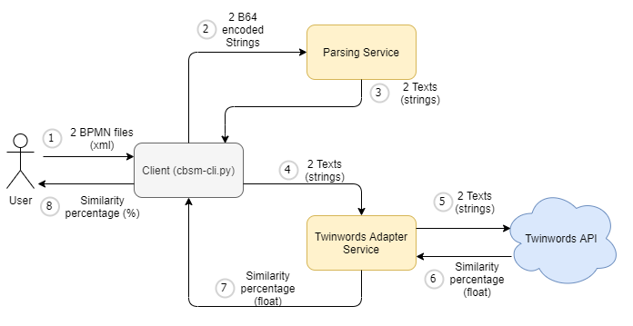

# Content based similarity matching of BPMN processes

## Folders, files

- client:
    - Contains a CLI for invoking the backend services
- server:
    - Contains two microservices:
        - Parsing service: Converts a BPMN Process to a text
        - Twinwords Adapter service: Communicates with the Twinwords text similarity API.
- input:
    - Contains test data (BPMN files)
- documentation:
    - contains the documentation
    - the How-Tos were written in the respective directories (server, client)
- .gitlab-ci.yml:
    - Configuration for the Gitlab CI jobs
- docker-compose.yaml:
    - Helper for building and running the docker images (use: **docker-compose build** for building and **docker-compose up** for running)
- twinwords_api.env:
    - API Key for calling the Twinwords Text Similarity API

## Requirements

- python 3.x
    - The required packages for the client and the server are described in the respective folders.
- docker desktop 2.2.0.3 (min)
    - docker engine: 19.03.5
    - compose: 1.25.4
    - Note: Older versions might also work but it's not guaranteed.
    
## Dockerized

The two services are dockerized and a simple docker-compose.yaml file was created for easily starting the backend services.

The easiest way to run the services is to simply run

```
docker-compose build
docker-compose up
```

**NOTE**: In this case the backend services are started on the following URLs (Windows and Mac):
- Parsing service: http://host.docker.internal:8000
- Twinwords adapter service: http://host.docker.internal:8001

## Architecture overview:



1. User calls the cbsm-cli script and specifies the paths to the two BPMN files.
2. The two BPMN files are Base64 Encoded and the Parsing service is called with these values.
3. The Parsing service converts the two BPMN files to two texts.
4. The cbsm-cli calls the Twinwords adapter service with the two texts.
5. The Twinwords adapter service calls the Twinwords API with the two texts.
6. The Twinwords API returns a similarity percentage (float, between 0 and 1).
7. The Twinwords adapter service returns the similarity percentage to the cbsm-cli.
8. The cbsm-cli displays the similarity percentage (in percentage: between 0 and 100).

## Development

### Infrastructure

The Kubernetes Cluster which is used for the workers during each CI Build is hosted on my own Google Cloud Platform.

### CI

A rudimentary CI system was configured for this repository.

What works:
- Running pylint on each commit for linting the python scripts

What doesn't work yet:
- Building the docker images on each git tag. I didn't have enough time to figure out how to configure the Kaniko Build

### CD

It would be nice to automatically build the docker image on each git tag and also deploy these docker images to GKE

### Secrets

Github has a really nice feature of storing secrets securely in the github project. Gitlab unfortunately doesn't.
My API Key for the Twinwords API Service is stored in plain text in this repository, which normally is a really really bad practice.

A solution might be configuring a Hashicorp Vault and storing the secrets there. That is unfortunately out of the scope of this project.
